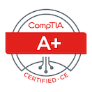

# Hi, I'm Sean Hopkins

I am passionate about technology and microelectronics. 

Some technologies I have used are:
- Languages: Java, Javascript, C, C++, C#, Python
- Backend: Nodejs, Express, MongoDB, SQL
- Frontend: Nextjs, React, Angular
- Styling: CSS, SCSS, MUI, Bootstrap

 CompTia A+ Certified

